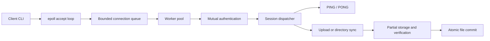

# SyncWire

### Authenticated, resumable file transfer and directory synchronization in C++20

SyncWire is a Linux client-server application that uploads files and incrementally synchronizes directory trees over TCP. It implements its own framed binary protocol, handles interrupted transfers, authenticates peers, and verifies file contents before committing them to the destination.

The project explores the engineering behind reliable network software: handling TCP as a byte stream, coordinating concurrent clients, limiting resource use, maintaining filesystem consistency, and recovering from disconnects and server restarts.

**Technology:** C++20 · Linux/POSIX · TCP sockets · epoll · OpenSSL · HMAC-SHA256 · CRC-32 · CMake · CTest · Python · GitHub Actions

## Engineering highlights

- **Custom binary protocol:** explicit byte-order encoding, a versioned 32-byte header, request IDs, bounded payloads, and incremental frame parsing.
- **Verified file uploads:** 64 KiB chunks, contiguous offsets, acknowledgments, streaming CRC-32 verification, and atomic file replacement.
- **Incremental directory sync:** compares manifests and transfers only missing or changed files while preserving server-only files.
- **Bounded concurrency:** combines an `epoll` accept loop with a connection queue and configurable `std::jthread` worker pool.
- **Mutual authentication:** uses fresh client/server nonces and HMAC-SHA256 proofs without sending the shared secret.
- **Restart recovery:** retains partial uploads, verifies their prefixes, and resumes across reconnects and server restarts.
- **Failure-focused validation:** includes protocol, filesystem, authentication, concurrency, and recovery tests, plus a real TCP acceptance script.

## Architecture



The accept loop handles connection readiness while workers execute blocking protocol sessions. This preserves straightforward, testable transfer state machines while supporting multiple clients. Destination-changing sessions are serialized to protect filesystem state; read-only PING sessions can run in parallel.

## Skills developed and demonstrated

| Area | Evidence in the project |
| --- | --- |
| Modern C++ and resource ownership | Move-only RAII file descriptors, explicit object lifetimes, standard-library containers, and `std::jthread` workers. |
| Linux network programming | POSIX sockets, partial send/receive loops, `EINTR` handling, disconnect detection, `MSG_NOSIGNAL`, and `epoll`. |
| Protocol design | Versioning, network byte order, framing, request correlation, incremental parsing, payload bounds, and operation state machines. |
| Concurrency and overload handling | Bounded admission, worker coordination, serialized writes, synchronized logging, atomic counters, and shutdown cancellation. |
| Filesystem correctness | Path validation, symlink checks, temporary files, `fsync()`, integrity verification, and atomic rename. |
| Applied cryptography | OpenSSL random nonces, domain-separated HMAC proofs, constant-time comparison, and a clear distinction between authentication and encryption. |
| Recovery and resilience | Persistent partial state, prefix verification, bounded storage, reconnect retries, and recovery after server restarts. |
| Testing and automation | Unit and socket integration tests, Debug/Release CI, ASan/UBSan, and a Python acceptance script using real TCP connections. |

## Transfer design

### Framing and socket I/O

TCP does not preserve application message boundaries. SyncWire explicitly encodes and decodes frames rather than sending C++ structures directly. The parser retains incomplete data and supports multiple frames arriving in one read. Headers are checked before payload allocation, and socket helpers handle partial I/O and interruptions.

### Verified uploads

The client calculates the source size and CRC-32, then sends metadata and bounded chunks. The server validates offsets and writes to private partial storage. The completed file becomes visible at its final path only after size and checksum verification. Single-file upload names must be basenames; directory synchronization uses validated relative paths for nested files.

### Incremental synchronization

Client and server exchange manifests containing paths, sizes, and checksums. A transfer plan identifies missing or changed files. Multiple uploads reuse the same connection, and a final scan verifies the source files against the destination. Symlinks are skipped, and server-only files are preserved.

### Resume and recovery

Protocol v2 offers a saved offset and prefix CRC-32. The client checks its own source prefix before reusing the saved bytes; mismatched prefixes restart from zero. Whole-file size and checksum verification still gate the final commit.

Partial identities use SHA-256 keys derived from remote path, size, and whole-file CRC. Saved state lives under `.syncwire-partials`, with default limits of 64 partial files and 4 GiB per destination root. Chunks are synchronized before acknowledgment. Transport failures trigger up to two automatic retries by default; authentication and protocol errors are not retried.

## Build and test

### Requirements

- Linux, including a suitable Linux VM or WSL environment.
- A C++20 compiler, CMake 3.20+, Ninja, and OpenSSL 3 development headers.
- Python 3 for the real TCP acceptance script.

On Ubuntu 24.04:

```bash
sudo apt update
sudo apt install -y build-essential cmake ninja-build libssl-dev python3 git

git clone https://github.com/ShayaanRashedin/syncwire.git
cd syncwire
cmake --preset debug
cmake --build --preset debug
ctest --preset debug
```

## Run a local demonstration

Open two Bash terminals in the project directory. In **each terminal**, enter the same pre-shared key when prompted:

```bash
read -rsp 'SyncWire PSK: ' SYNCWIRE_PSK
export SYNCWIRE_PSK
echo
```

Use a secret between 16 and 1024 bytes. It is read from the environment rather than a command-line argument.

### 1. Start the server

In the first terminal:

```bash
./build/debug/syncwire-server 4040 received 4
```

This binds to `127.0.0.1:4040`, uses `received` as the destination, and starts four workers. Press `Ctrl+C` to initiate coordinated shutdown and print session statistics.

### 2. Check an authenticated connection

In the second terminal:

```bash
./build/debug/syncwire-client 127.0.0.1 4040 ping 42
```

Expected response: `PONG received for request 42`.

### 3. Upload and verify a file

```bash
printf 'Hello from SyncWire\n' > example.txt
./build/debug/syncwire-client 127.0.0.1 4040 upload example.txt stored.txt 43
cmp example.txt received/stored.txt
```

`cmp` exits successfully without output when the files match. The client also reports transfer results, including bytes reused and bytes sent in the successful attempt.

### 4. Synchronize a directory

```bash
mkdir -p demo-source/nested
printf 'alpha\n' > demo-source/a.txt
printf 'beta\n' > demo-source/nested/b.txt

./build/debug/syncwire-client 127.0.0.1 4040 sync demo-source 100
./build/debug/syncwire-client 127.0.0.1 4040 sync demo-source 101
```

The second run should recognize unchanged files and avoid uploading them again. Modify a source file and repeat the command to exercise incremental transfer. Files found only on the server remain in place.

Rerunning an interrupted upload or sync resumes eligible saved state. Append `--retries 0` to disable automatic transport retries or `--retries 5` to select the maximum.

## Testing and verification

Tests cover frame boundaries, fragmented input, descriptor ownership, partial socket I/O, authentication failures, invalid paths, transfer offsets, checksums, recursive sync, resume recovery, and concurrent shutdown.

For release and acceptance validation:

```bash
cmake --preset release
cmake --build --preset release
ctest --preset release --verbose
python3 scripts/verify_resume.py --build-dir build/release
```

The acceptance script starts its own loopback server and tests interruption, restart, retry, and synchronization. It verifies resulting file contents with SHA-256. Its local upload timing is a demonstration measurement, not a WAN or scalability benchmark.

GitHub Actions defines Debug and Release builds plus an AddressSanitizer/UndefinedBehaviorSanitizer configuration. Compiler warnings are treated as errors in CI.

## Project layout

```text
apps/syncwire-client/  Client command parsing and reconnect logic
apps/syncwire-server/  Server configuration and lifecycle
include/syncwire/     Protocol types and component interfaces
src/common/           Codecs, sockets, authentication, transfer, and sync
src/server/           Session dispatch and concurrent server runtime
tests/unit/           Unit and socket integration tests
scripts/              Real TCP acceptance verification
.github/workflows/    Build, sanitizer, and acceptance automation
```

## Security boundary and tradeoffs

- The handshake authenticates possession of a shared secret. It **does not encrypt file contents or authenticate subsequent data frames**. The server CLI binds to loopback; use an appropriately secured encrypted transport for untrusted links.
- CRC-32 detects accidental corruption, not malicious modification. SHA-256 partial-storage identifiers do not change that boundary.
- Synchronization is one-way push. Downloads, deletion propagation, filesystem watching, and multi-user authorization are not implemented.
- Destination mutations are serialized. A worker pool does not imply parallel writes to the destination.
- Sockets have no idle deadlines, so silent clients can occupy workers. Storage budgets limit partial state but do not automatically remove stale transfers.
- Files are committed individually; an entire directory synchronization is not atomic. Source files should remain stable during an operation.
