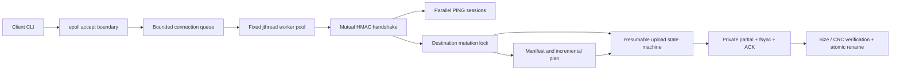

# Architecture and engineering tradeoffs

SyncWire is a C++20/Linux portfolio MVP: an authenticated, resumable upload service plus
incremental one-way directory synchronization. Its goal is to demonstrate explicit invariants,
bounded resource ownership, recovery testing, and explainable tradeoffs.

`epoll` is used for accept readiness, not for every connection's I/O. A worker performs the
authentication handshake and then the requested operation using blocking partial-I/O loops.

## Ownership and boundaries

| Component | Responsibility |
| --- | --- |
| `codec` / `frame_parser` | Portable binary encoding, validation before allocation, fragmented/coalesced input |
| `UniqueFd` / socket helpers | Move-only ownership, partial reads/writes, EINTR and peer-close behavior |
| `authentication` | Fresh challenges, domain-separated client/server HMAC proofs, constant-time comparison |
| `file_transfer` | Source preflight, resume negotiation, contiguous writes, integrity checks, commit |
| `directory_manifest` / `directory_sync` | Bounded tree scans and plans; preserve server-only paths |
| `ConcurrentServer` | Admission, bounded queue, worker lifecycle, shutdown and aggregate counters |
| CLI | Configuration, reconnect policy, readable results; never owns protocol wire encoding |

## Recovery invariants

1. The final path is untouched until all declared bytes pass size and CRC verification.
2. Only complete received chunk payloads are appended. A truncated network frame is never written.
3. The partial filename is SHA-256 of encoded upload metadata. A new request ID can recover the
   same identity, but a changed path/size/CRC starts a different identity.
4. On reconnect, the server re-reads the stored bytes to reconstruct the running CRC. The client
   independently checks the same prefix before skipping it. A mismatch restarts at offset zero.
5. Each ACK follows file and state-directory fsync. After a process restart, disk state—not
   in-memory counters—determines the next resume offer.
6. A transport interruption keeps state; malformed protocol or integrity rejection removes that
   identity. The reserved internal directory never enters a sync manifest.
7. A lost final result can cause a full repeat upload. Retries are safe but do not promise
   exactly-once delivery. The final content remains verified.

## Why these tradeoffs?

- **Hybrid reactor/worker pool:** simpler verified session state machines with bounded threads.
  Idle deadlines and fully asynchronous per-connection I/O remain future work.
- **One destination lock:** safe within one server process without a complex path-lock graph.
  PING remains parallel, but simultaneous writes serialize. Do not market this as parallel disk writes.
- **Per-chunk fsync and stop-and-wait ACK:** straightforward durable recovery boundaries, at a
  throughput cost. Pipelining and batched durability would need a separately specified recovery model.
- **CRC-32 for files:** detects accidental corruption and powers incremental planning. It is not
  collision-resistant security. SHA-256 storage-key encoding does not upgrade the file CRC guarantee.
- **No automatic deletion:** rerunning sync is conservative; unrelated destination data survives.
- **Disk-backed partials without a database:** resume state is just a regular file in a reserved
  directory. A bounded scanner enforces admission budgets; orphan expiry is an operator task.

## Security and durability limits

HMAC authentication alone does not stop an active attacker from altering later data frames.
Keep traffic on loopback or an authenticated encrypted tunnel. All PSK holders share one trust
domain: there are no per-user files, quotas, or identities. A 16-character minimum is a length
check, not an entropy estimate; use randomly generated secrets.

The service assumes a dedicated destination root controlled by its own OS user, no hostile local
path replacement, and one server process per root. Leaf state uses no-follow opens, regular-file
and hardlink checks, and advisory locks. Those checks do not provide complete containment against
an attacker concurrently renaming ancestor directories. Files must fit the configured size limits.

The tests prove process-disconnect/restart recovery, not power-loss durability on every filesystem.
Fsync/rename failures may leave a committed file even when the client receives failure; retrying
is safe. A whole directory sync is not atomic, and source trees should be stable while scanning.
